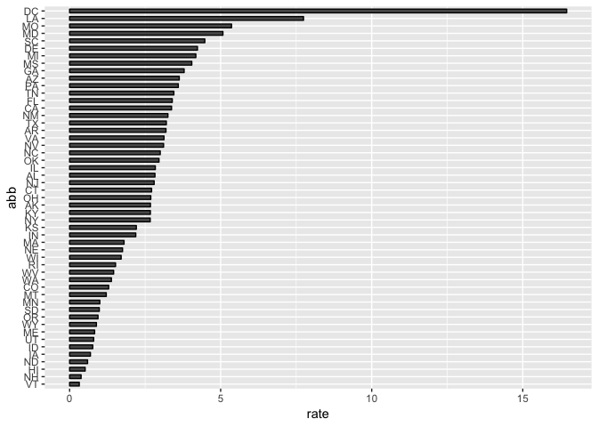

Report on Gun Murders
================
7/17/2018

Introduction
------------

This report introduces basic principles of "reproducible reports" as demonstrated by Rafael Irizarry at [his GitHub repo](https://github.com/rairizarry/murders). To illustrate, we use 2010 gun murder rates obtained from FBI reports.

We use the following library:

``` r
library(tidyverse)
```

...and load our derived dataset:

``` r
load("rda/murders.rda")
```

Murder rates by state
---------------------

We note the large state to state variability by generating a barplot showing the murder rate by state:


